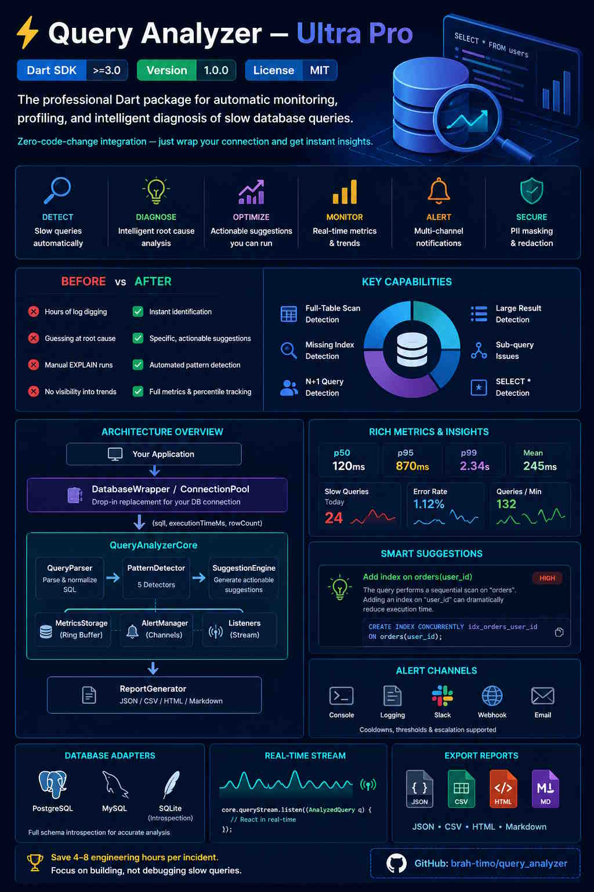

# ⚡ Query Analyzer — Ultra Pro

[](https://dart.dev)
[](CHANGELOG.md)
[](LICENSE)

> **The professional Dart package for automatic monitoring, profiling, and intelligent diagnosis of slow database queries.** Zero-code-change integration — just wrap your connection and get instant insights.

---





## 📋 Table of Contents

- [Why Query Analyzer?](#why-query-analyzer)
- [Features](#features)
- [Installation](#installation)
- [Quick Start](#quick-start)
- [Architecture](#architecture)
- [Configuration](#configuration)
- [Detection Capabilities](#detection-capabilities)
- [Suggestion Engine](#suggestion-engine)
- [Reporting & Export](#reporting--export)
- [Alert Channels](#alert-channels)
- [Database Adapters](#database-adapters)
- [API Reference](#api-reference)
- [Examples](#examples)
- [Testing](#testing)
- [Roadmap](#roadmap)

---

## Why Query Analyzer?

In production, a **single slow query** can bring your entire application to a halt. Finding which query is responsible — among thousands — wastes hours of developer time. Query Analyzer solves this by:

| Before | After |
|--------|-------|
| Hours of log digging | Instant identification |
| Guessing at root cause | Specific, actionable suggestions |
| Manual `EXPLAIN` runs | Automated pattern detection |
| No visibility into trends | Full metrics & percentile tracking |

**ROI**: A typical mid-size team saves **4–8 engineering hours per incident** × the number of incidents per year.

---

## Features

| Category | Feature |
|----------|---------|
| 🔍 **Detection** | Full-table scan, missing index, N+1, large result, sub-query issues, SELECT *, unindexed ORDER BY |
| 💡 **Suggestions** | Concrete SQL statements you can run immediately |
| 📊 **Metrics** | p50/p75/p90/p95/p99 percentiles, mean, std-dev, error rate per query pattern |
| 📈 **Reports** | JSON, CSV, HTML, Markdown export |
| 🔔 **Alerts** | Console, logging, Slack, generic webhook — with cooldown & thresholds |
| 🗄️ **Adapters** | PostgreSQL, MySQL, SQLite schema introspection |
| 🔒 **Security** | PII masking, sensitive value redaction before logging |
| 🏊 **Pool** | Connection-pool wrapper with round-robin distribution |
| ⚡ **Stream** | Real-time `Stream<AnalyzedQuery>` for reactive monitoring |
| 🧪 **Testing** | 100% pure Dart — mock-friendly, no native dependencies required |

---

## Installation

```yaml
# pubspec.yaml
dependencies:
  query_analyzer: ^1.0.0
```

```bash
dart pub get
```

---

## Quick Start

```dart
import 'package:query_analyzer/query_analyzer.dart';

// 1. Create the analyzer
final core = QueryAnalyzerFacade.create(
  config: QueryAnalyzerConfig.custom(
    slowQueryThresholdMs: 500,
    detectNPlusOne: true,
  ),
  schema: DatabaseSchema.empty('postgresql'), // or use a real adapter
  onSlowQuery: (sql, ms, suggestions) {
    print('⚠️  Slow query ${ms}ms: $sql');
    for (final s in suggestions) print('   → ${s.title}');
  },
);

// 2. Wrap your connection (implements DatabaseConnection)
final db = DatabaseWrapper(connection: myConn, analyzer: core);

// 3. Use normally — analysis happens automatically
final users = await db.query('SELECT * FROM users WHERE id = ?', arguments: [42]);

// 4. Generate a report
final report = QueryAnalyzerFacade.generateReport(core);
print(report.summary);
```

---

## Architecture

```
Your Application
      │
      ▼
┌─────────────────────┐
│   DatabaseWrapper   │  ← drop-in replacement for your DB connection
│  ConnectionPool     │
└────────┬────────────┘
         │ (sql, executionTimeMs, rowCount)
         ▼
┌─────────────────────────────────────────────────────────┐
│                  QueryAnalyzerCore                      │
│                                                         │
│  ┌──────────────┐  ┌─────────────────┐  ┌───────────┐  │
│  │ QueryParser  │→ │ PatternDetector │→ │Suggestion │  │
│  │              │  │  (5 detectors)  │  │  Engine   │  │
│  └──────────────┘  └─────────────────┘  └───────────┘  │
│                                                         │
│  ┌──────────────┐  ┌───────────────┐  ┌─────────────┐  │
│  │MetricsStorage│  │  AlertManager │  │  Listeners  │  │
│  │  (ring buf)  │  │  (channels)   │  │  (stream)   │  │
│  └──────────────┘  └───────────────┘  └─────────────┘  │
└─────────────────────────────────────────────────────────┘
         │
         ▼
┌────────────────────┐
│   ReportGenerator  │ → JSON / CSV / HTML / Markdown
└────────────────────┘
```

---

## Configuration

```dart
QueryAnalyzerConfig.custom(
  // Slow-query threshold
  slowQueryThresholdMs: 1000,   // default: 1000ms

  // Logging
  logAllQueries: false,         // log every query, not just slow ones
  maskSensitiveValues: true,    // redact literals before logging

  // Storage
  maxStoredQueries: 500,        // ring-buffer size
  persistMetrics: false,        // persist to local SQLite

  // Detectors
  detectFullTableScan: true,
  detectMissingIndex: true,
  detectNPlusOne: true,
  detectLargeResult: true,
  detectSubqueryIssues: true,
  detectSelectStar: true,

  // N+1 tuning
  nPlusOneWindowMs: 5000,       // rolling window
  nPlusOneMinCount: 5,          // min occurrences to flag

  // Large result tuning
  largeResultRowThreshold: 10000,

  // Tag for multi-database setups
  databaseTag: 'primary',
)
```

---

## Detection Capabilities

| Detector | What it finds | Severity |
|----------|--------------|----------|
| `FullTableScanDetector` | Queries with no WHERE or WHERE on un-indexed columns | High / Critical |
| `MissingIndexDetector` | Un-indexed WHERE, JOIN, and ORDER BY columns | Medium → Critical |
| `NPlusOneDetector` | Same query repeated N times in a short window | High / Critical |
| `LargeResultDetector` | Unbounded queries returning 10k+ rows | High / Critical |
| `SubqueryDetector` | Correlated, deeply nested, or SELECT-list sub-queries | High / Critical |

---

## Suggestion Engine

Every detected issue is translated into a concrete suggestion:

```dart
QuerySuggestion(
  type: SuggestionType.addIndex,
  title: 'Add index on orders(user_id)',
  description: 'The query performs a sequential scan on "orders". '
               'Adding an index on "user_id" can dramatically reduce execution time.',
  sqlStatement: 'CREATE INDEX CONCURRENTLY idx_orders_user_id ON orders(user_id);',
  estimatedImprovementPercent: 70,
  priority: SuggestionPriority.high,
)
```

**Suggestion types**: `addIndex`, `addPagination`, `refactorQuery` (N+1), `rewriteSubquery`, `removeRedundantColumns`, `optimizeJoin`, `addCaching`, `updateStatistics`.

---

## Reporting & Export

```dart
final report = QueryAnalyzerFacade.generateReport(core,
  timeRange: const Duration(hours: 24));

// Plain-text summary
print(report.summary);

// JSON
final json = ReportExporter.toJson(report);

// CSV (slow queries table)
final csv = ReportExporter.toCsv(report);

// HTML (full dashboard page)
final html = ReportExporter.toHtml(report);

// Markdown
final md = ReportExporter.toMarkdown(report);
```

---

## Alert Channels

```dart
final alertManager = AlertManager(
  channels: [
    ConsoleAlertChannel(),               // stdout
    LoggingAlertChannel(),               // dart:logging
    SlackAlertChannel(
      webhookUrl: 'https://hooks.slack.com/...',
      channel: '#db-alerts',
    ),
    WebhookAlertChannel(
      url: 'https://ops.example.com/alerts',
      headers: {'Authorization': 'Bearer $token'},
    ),
  ],
  thresholds: ThresholdConfig(
    slowQueryMs: 500,
    alertCooldown: Duration(minutes: 15),
  ),
);

core.addListener(alertManager);
```

---

## Database Adapters

Extend the provided abstract adapters to get **full schema introspection**:

```dart
class MyPostgresDb extends PostgresAdapter {
  // Implement DatabaseConnection using your postgres package
  @override
  Future<List<Map<String, dynamic>>> query(String sql, ...) async { ... }
  ...
}

// Then introspect
final schema = await db.introspectSchema(schema: 'public');
final core = QueryAnalyzerFacade.create(schema: schema, ...);
```

Available adapters: `PostgresAdapter`, `MySqlAdapter`, `SQLiteAdapter`.

---

## API Reference

### `QueryAnalyzerFacade`

| Method | Description |
|--------|-------------|
| `create({config, schema, onSlowQuery})` | Create a `QueryAnalyzerCore` |
| `wrap(connection, {config, schema})` | Create a `DatabaseWrapper` in one step |
| `generateReport(core, {timeRange})` | Build an `AnalysisReport` |
| `topSlowQueries(core, {n})` | Get top-N slow queries |

### `DatabaseWrapper`

| Method | Description |
|--------|-------------|
| `query(sql, {arguments})` | Execute SELECT, auto-measured |
| `execute(sql, {arguments})` | Execute INSERT/UPDATE/DELETE |
| `onSlowQuery = callback` | Set slow-query callback |

### `QueryAnalyzerCore`

| Property/Method | Description |
|----------------|-------------|
| `queryStream` | `Stream<AnalyzedQuery>` — all queries |
| `slowQueryStream` | Filtered to slow queries only |
| `addListener(listener)` | Register a `QueryListener` |
| `storage` | Access `MetricsStorage` directly |
| `reset()` | Clear all stored data |
| `dispose()` | Release resources |

---

## Examples

| File | Description |
|------|-------------|
| `example/basic_usage.dart` | Minimal integration in 30 lines |
| `example/advanced_features.dart` | Schema, pool, listeners, streaming |
| `example/custom_alerts.dart` | Slack + webhook alert pipeline |
| `example/report_generation.dart` | All export formats |
| `example/web_server_integration.dart` | Shelf-compatible HTTP server |

Run any example:

```bash
dart run example/basic_usage.dart
```

---

## Testing

```bash
# All tests
dart test

# Unit tests only
dart test test/unit/

# Integration tests
dart test test/integration/

# With coverage
dart run coverage:collect_coverage --out=coverage/coverage.json
dart run coverage:format_coverage --lcov --in=coverage/coverage.json --out=coverage/lcov.info
```

---

## Roadmap

- [ ] `v1.1.0` — MongoDB adapter
- [ ] `v1.1.0` — Prometheus / OpenMetrics export
- [ ] `v1.2.0` — Predictive analytics (ML-based anomaly detection)
- [ ] `v1.2.0` — Datadog / New Relic integration
- [ ] `v1.3.0` — Query plan visualization (ASCII + HTML)
- [ ] `v2.0.0` — Full SQLite persistence layer via `sqflite_common_ffi`

---

## License

MIT © 2026 — See [LICENSE](LICENSE)
